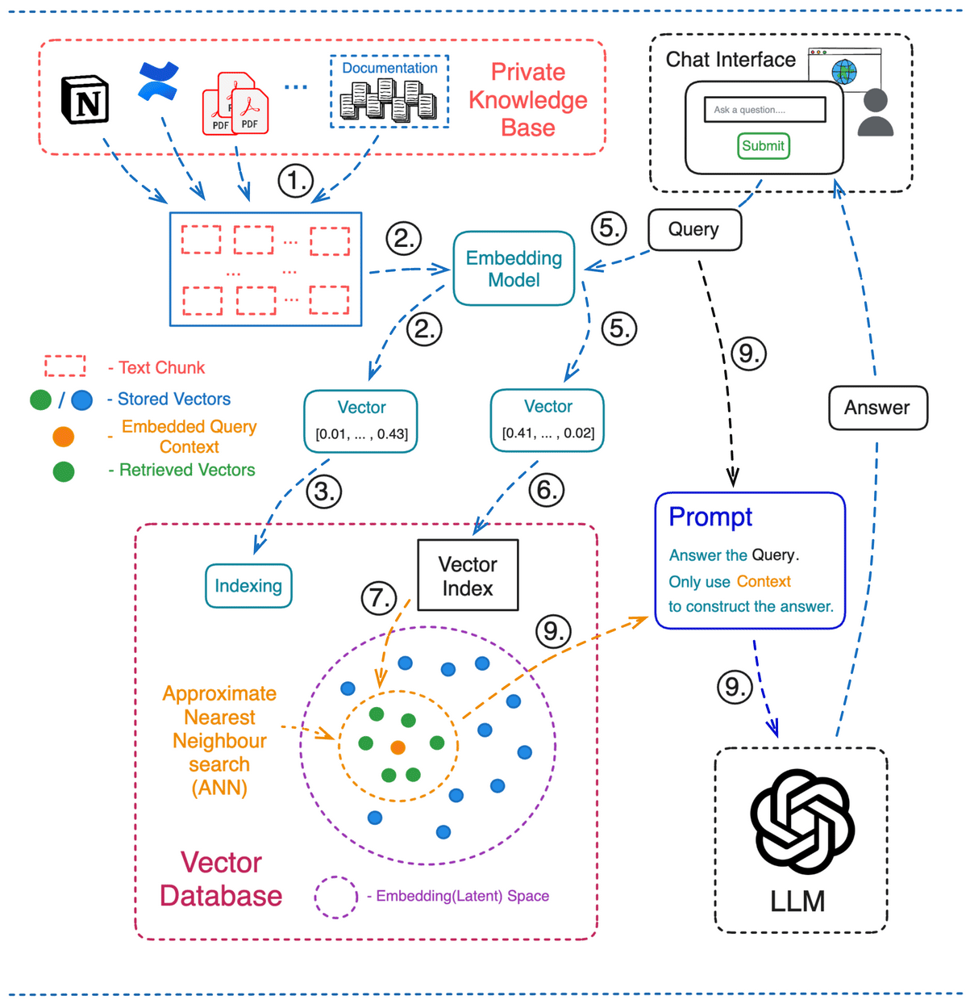

# RAG Document Application

This FastAPI-based RAG service processes OCR data, generates embeddings using OpenAI, and utilizes Pinecone as a vector database for search. It answers questions based on search results using OpenAI.



## Contents
- [Checklist](#checklist)
- [Installation](#installation)
- [Configuration](#configuration)
- [Usage](#usage)
- [Endpoints](#endpoints)

## Checklist
- [x] Secured all endpoints with API keys using FastAPI's Security Class (OAuth2).
- [x] Rate limiting to prevent abuse.
- [x] Asynchronous processing.
- [x] File uploading (AWS S3) including validation and sanitization.
- [x] OCR processing (from mock files), Embedding generation using OpenAI.
- [ ] End-2-End OCR (Model Serving) and Google APIs, Mathpix API Integrations
- [x] Storage and search of embeddings with Pinecone.
- [x] Search from the document
- [x] Applied Tokenizers for better search performance. 
- [x] Talk to your data! Chat and generate the answer from the search results using OpenAI's chat completions.
- [ ] OpenAPI chat completion streaming support
- [x] Dockerize App.
- [x] Implemented Redis for caching and frequent queries.
- [x] The detailed comments, docstrings, lint checks, pip8. 
- [ ] CD (GitHub actions)
- [ ] CI & PyTest codes
- [ ] Chat Interface 


## Prerequisites
- Python 3.11 
- Docker
- Docker Compose (v2.20.2)
- AWS S3 Credentials (API-Keys)
- OpenAI API-Key
- Pinecone API-Key
- Prepare your .env file, learn in [Configuration](#configuration)


## Installation

 ```bash
 git clone https://github.com/teamunitlab/rag-document-app.git
 cd rag-document-app/
 docker-compose up -d --build
 ```


## Configuration
1. Fill a `.env` file in the root directory and add the following environment variables:
    ```env
    API_KEY=your_api_key_here
    OPENAI_API_KEY=your_openai_api_key_here
    PINECONE_API_KEY=your_pinecone_api_key_here
    PINECONE_INDEX_NAME=your_pinecone_index_name
    AWS_ACCESS_KEY_ID=your_aws_access_key_id
    AWS_SECRET_ACCESS_KEY=your_aws_secret_access_key
    AWS_DEFAULT_REGION=your_aws_region
    BUCKET_NAME=your_s3_bucket_name
    ```

2. Ensure AWS credentials and bucket policies are correctly configured to allow S3 access.

## Usage
1. Run the FastAPI application:
    ```bash
    docker-compose up -d
    ```

2. Access the API documentation at `http://localhost:8000/docs`.

## Endpoints
### Upload File
- **URL**: `/upload`
- **Method**: `POST`
- **Description**: Upload files to S3. Limited to 10 requests per minute.
- **Request**:
    - `files`: List of files to upload.
    - `API-Key`: Header for API key authentication.
- **Response**: JSON containing file IDs and URLs.

### Process OCR
- **URL**: `/ocr`
- **Method**: `POST`
- **Description**: Process OCR for a given file URL. Limited to 10 requests per minute.
- **Request**:
    - `url`: URL of the file to process, it is obtained during file (ducument) uploading.
    - `API-Key`: Header for API key authentication.
- **Response**: JSON containing information about the processing status.

### Extract Data
- **URL**: `/extract`
- **Method**: `POST`
- **Description**: Reply to a query using OpenAI chat completions and search based on the given File ID from Pinecone, Limited to 10 requests per minute.
- **Request**:
    - `file_id`: The file ID, it is obtained during file (ducument) uploading.
    - `query`: Ask a question from your document!
    - `API-Key`: Header for API key authentication.
- **Response**: JSON containing information about a reply to the question and the three top search results. 

### References
1. http://unitlab.ai/
2. https://blog.unitlab.ai/unitlab-ai-data-collection-and-annotation-for-llms-and-generative-ai/
3. https://docs.unitlab.ai/ai-models/model-integration
4. https://blog.unitlab.ai/


